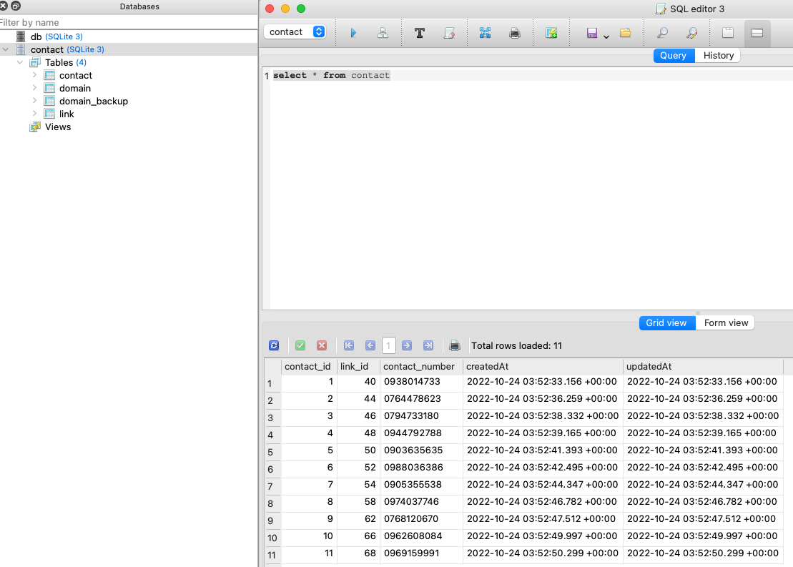

# Web crawler

This is a proof of concept to show how to combine the following technologies

## Tools/Technologies use

- [Layered/Clean Architecture](https://blog.cleancoder.com/uncle-bob/2012/08/13/the-clean-architecture.html "link title")
- [Typescript](https://www.typescriptlang.org/ "link title")
- [yargs](https://www.npmjs.com/package/yargs "link title")
- [Inversion Of Control](https://en.wikipedia.org/wiki/Inversion_of_control "link title")
- [InversifyJS](https://inversify.io/ "link title")
- [Sqlite](https://www.sqlite.org/index.html "link title")
- [Sequelize](https://sequelize.org/ "link title")
- [NodeJS Reflection](https://developer.mozilla.org/en-US/docs/Web/JavaScript/Reference/Global_Objects/Reflect "link title")
- [Meta Data Programming](https://en.wikipedia.org/wiki/Metaprogramming#:~:text=Metaprogramming%20is%20a%20programming%20technique,even%20modify%20itself%20while%20running. "link title")
- [Class Transformer](https://www.npmjs.com/package/class-transformer "link title")

## Getting Started

These instructions will get you a copy of the project up and running on your local machine for development and testing purposes. See deployment for notes on how to deploy the project on a live system.

- make sure you have nodejs >= 12
- create a folder where you want to copy the source files
- cd to source folder
- git clone https://github.com/vinbustamante/web-crawler.git
- cd to "web-crawler"
- to start crawling
  ```
  npm run crawl
  ```
- to add additional worker for processing the collected links
  ```
  npm run worker
  ```

## How to get the Report

Use [Sqlite Studio](https://sqlitestudio.pl/ "link title") to open the data/contact.db.

```
# to get the list of collected numbers
select * from contact
```



## Future Enhancement

- use [Zookeeper](https://zookeeper.apache.org/ "link title") to improve the node leader selection process
- use [ZeroMQ](https://zeromq.org/ "link title") to facilitate Leader and child process communication and to allow work to be run on other machine
- use [Postgres](https://www.postgresql.org/ "link title") as the database to more powerful query for analysis and have more worker node for processing without having an issue on querying.
- include unit test
